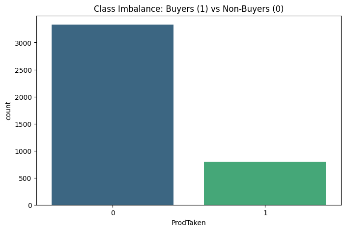
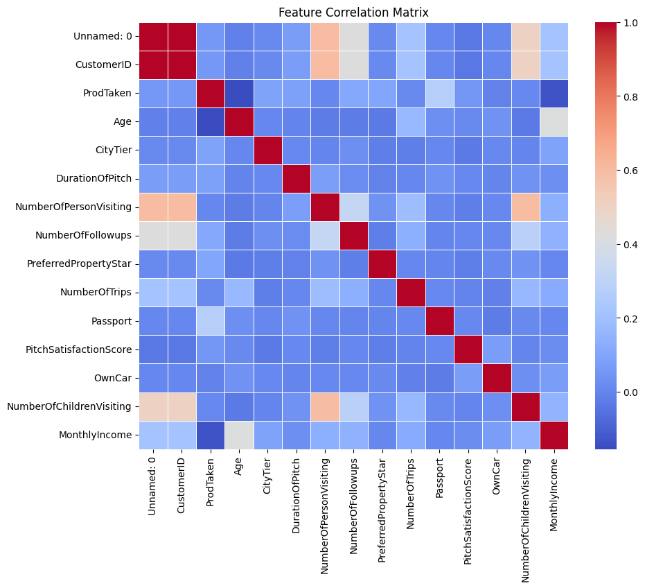
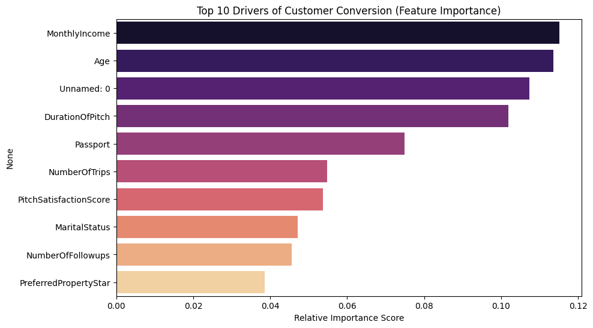

# 📊 Wellness Tourism Prediction: Insights

## 1. Executive Summary
This report captures the key data characteristics and the drivers of customer conversion.

## 2. Exploratory Data Analysis (EDA)

### Target Distribution

**💡 Observation:** The dataset is imbalanced. Only 19.3% of customers purchase the package. This confirms the need for F1-Score optimization over simple Accuracy.

### Correlation Matrix

**💡 Observation:** We observe strong correlations between 'MonthlyIncome' and 'Age'. There is also a notable relationship between 'Passport' possession and 'ProdTaken'.

## 3. Model Explainability

### Feature Importance

**💡 Observation:** The model identifies **MonthlyIncome** as the single most critical factor in predicting purchases. Marketing teams should prioritize this attribute when targeting segments.

