# 📊 Wellness Tourism Prediction: Insights

## 1. Executive Summary
This report captures the key data characteristics and the drivers of customer conversion.

## 2. Exploratory Data Analysis (EDA)

### Target Distribution

**💡 Observation:** The dataset is imbalanced. Only 19.3% of customers purchase the package. This confirms the need for F1-Score optimization over simple Accuracy.

### Correlation Matrix

**💡 Observation:** We observe strong correlations between 'MonthlyIncome' and 'Age'. There is also a notable relationship between 'Passport' possession and 'ProdTaken'.

### Univariate Distribution of Age
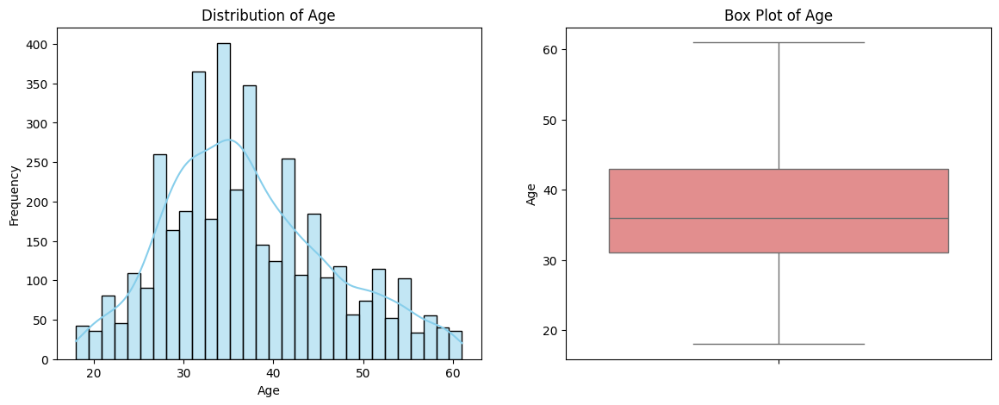

**💡 Observation:** The distribution of **Age** shows its central tendency and spread. Box plot indicates potential outliers.

### Univariate Distribution of DurationOfPitch
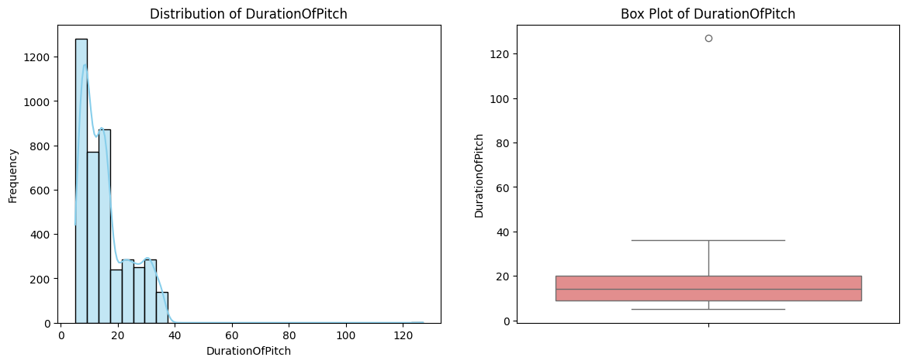

**💡 Observation:** The distribution of **DurationOfPitch** shows its central tendency and spread. Box plot indicates potential outliers.

### Univariate Distribution of NumberOfPersonVisiting
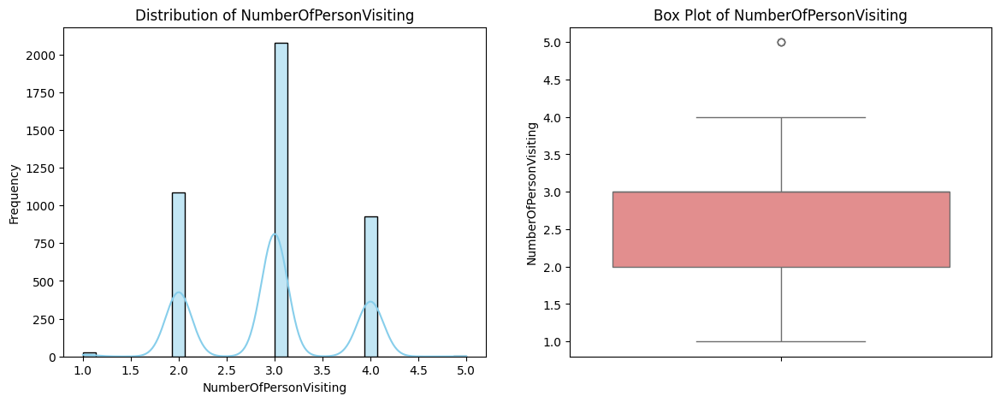

**💡 Observation:** The distribution of **NumberOfPersonVisiting** shows its central tendency and spread. Box plot indicates potential outliers.

### Univariate Distribution of PreferredPropertyStar
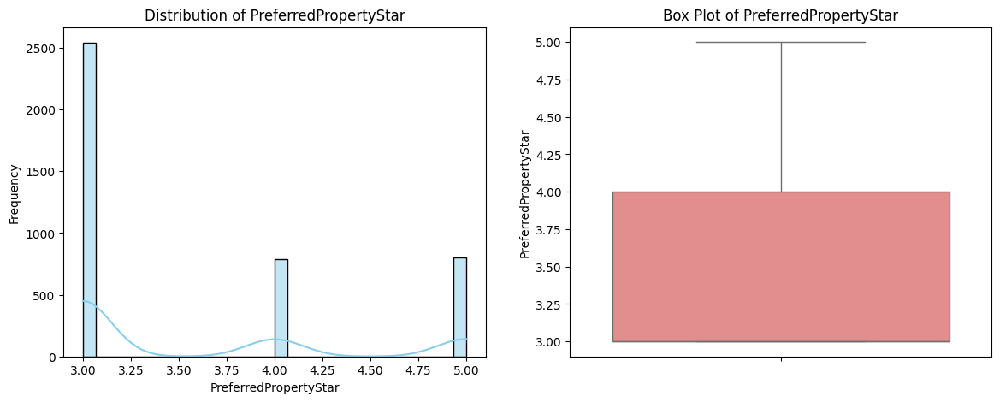

**💡 Observation:** The distribution of **PreferredPropertyStar** shows its central tendency and spread. Box plot indicates potential outliers.

### Univariate Distribution of NumberOfTrips
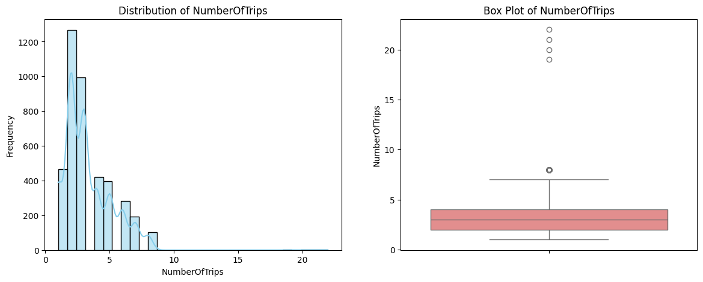

**💡 Observation:** The distribution of **NumberOfTrips** shows its central tendency and spread. Box plot indicates potential outliers.

### Univariate Distribution of NumberOfChildrenVisiting
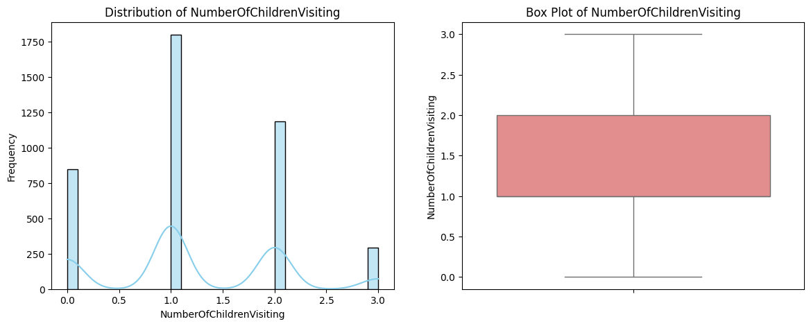

**💡 Observation:** The distribution of **NumberOfChildrenVisiting** shows its central tendency and spread. Box plot indicates potential outliers.

### Univariate Distribution of MonthlyIncome
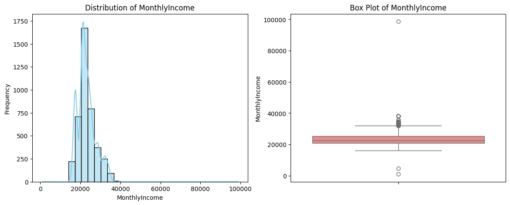

**💡 Observation:** The distribution of **MonthlyIncome** shows its central tendency and spread. Box plot indicates potential outliers.

### Univariate Distribution of PitchSatisfactionScore
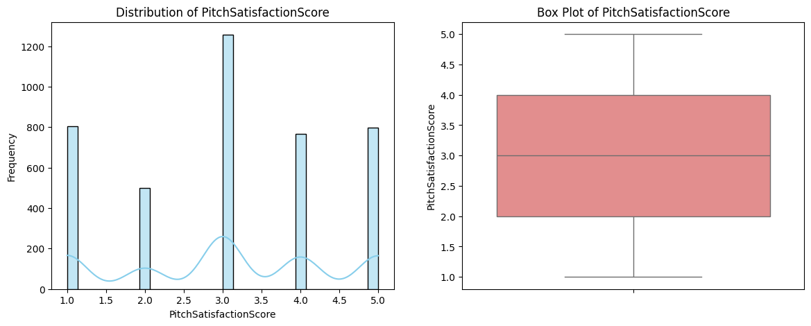

**💡 Observation:** The distribution of **PitchSatisfactionScore** shows its central tendency and spread. Box plot indicates potential outliers.

### Univariate Count of TypeofContact
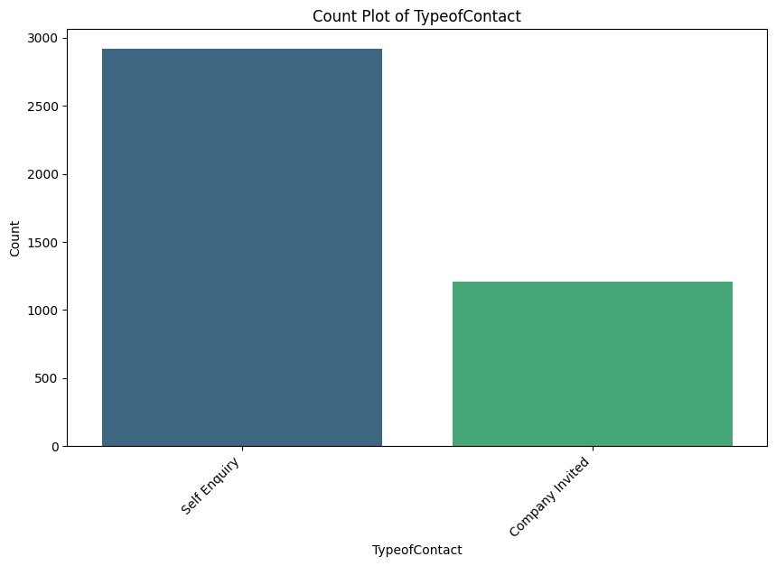

**💡 Observation:** The count plot for **TypeofContact** illustrates the frequency of each category within the dataset. Some categories are dominant.

### Univariate Count of CityTier
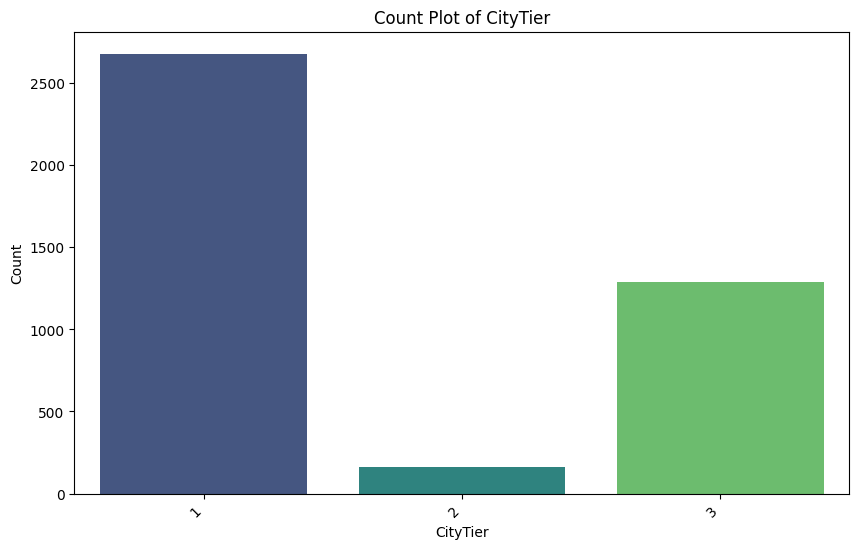

**💡 Observation:** The count plot for **CityTier** illustrates the frequency of each category within the dataset. Some categories are dominant.

### Univariate Count of Occupation
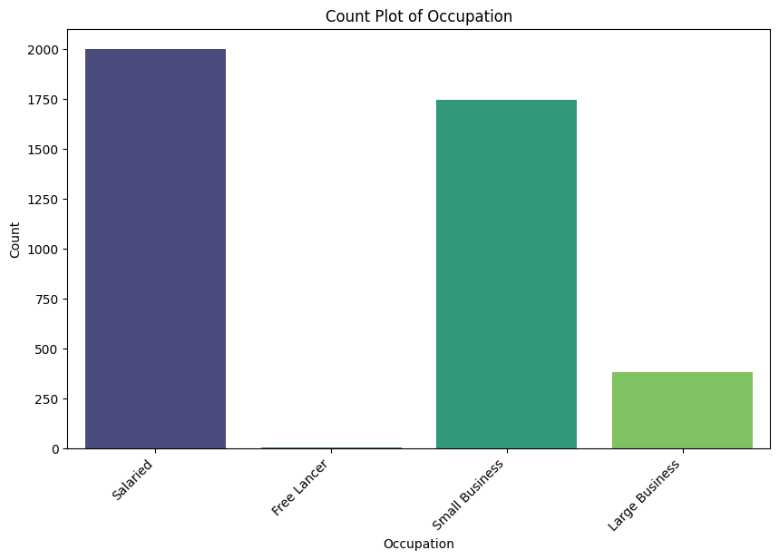

**💡 Observation:** The count plot for **Occupation** illustrates the frequency of each category within the dataset. Some categories are dominant.

### Univariate Count of Gender
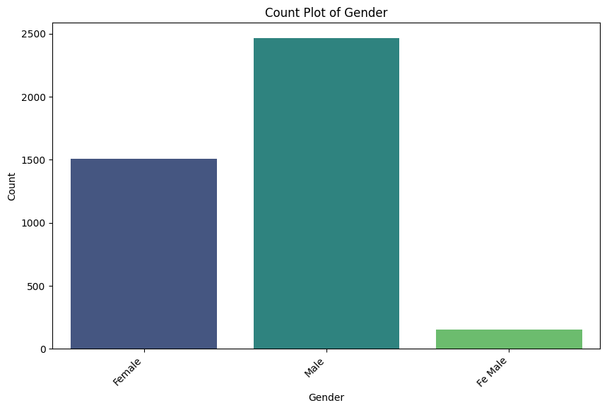

**💡 Observation:** The count plot for **Gender** illustrates the frequency of each category within the dataset. Some categories are dominant.

### Univariate Count of ProductPitched
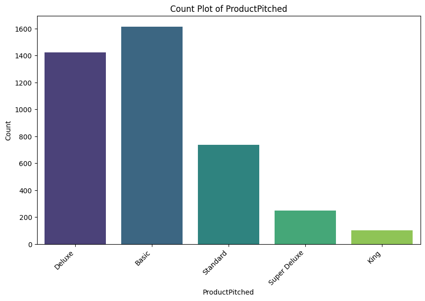

**💡 Observation:** The count plot for **ProductPitched** illustrates the frequency of each category within the dataset. Some categories are dominant.

### Univariate Count of MaritalStatus

**💡 Observation:** The count plot for **MaritalStatus** illustrates the frequency of each category within the dataset. Some categories are dominant.

### Univariate Count of Passport
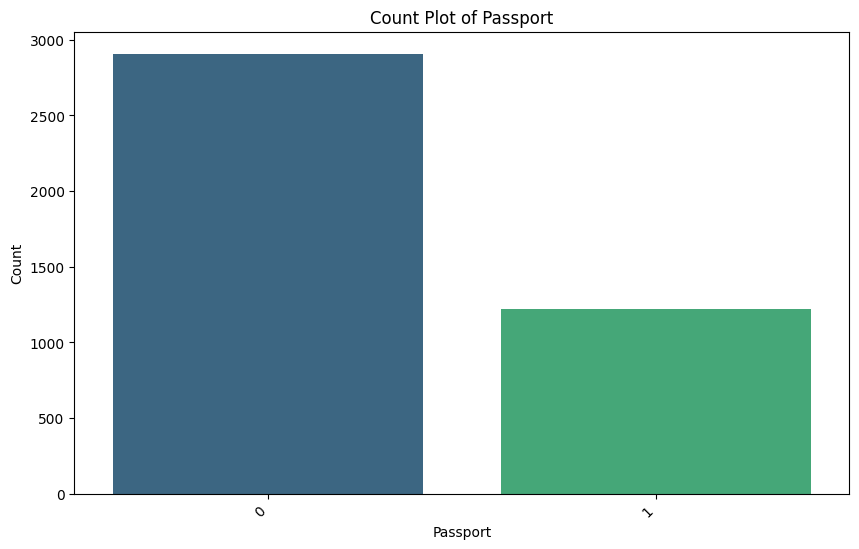

**💡 Observation:** The count plot for **Passport** illustrates the frequency of each category within the dataset. Some categories are dominant.

### Univariate Count of OwnCar
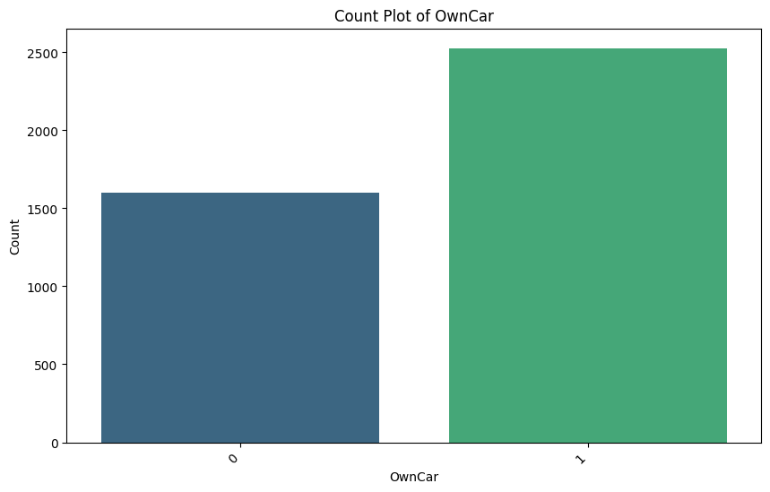

**💡 Observation:** The count plot for **OwnCar** illustrates the frequency of each category within the dataset. Some categories are dominant.

### Univariate Count of Designation
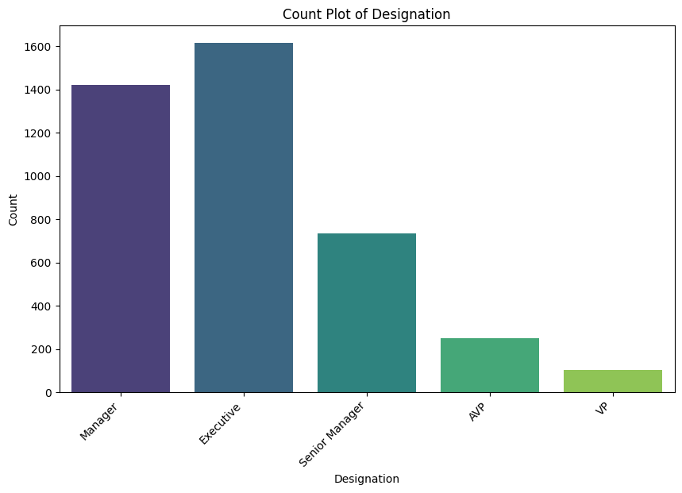

**💡 Observation:** The count plot for **Designation** illustrates the frequency of each category within the dataset. Some categories are dominant.

### Multivariate Age vs. ProdTaken
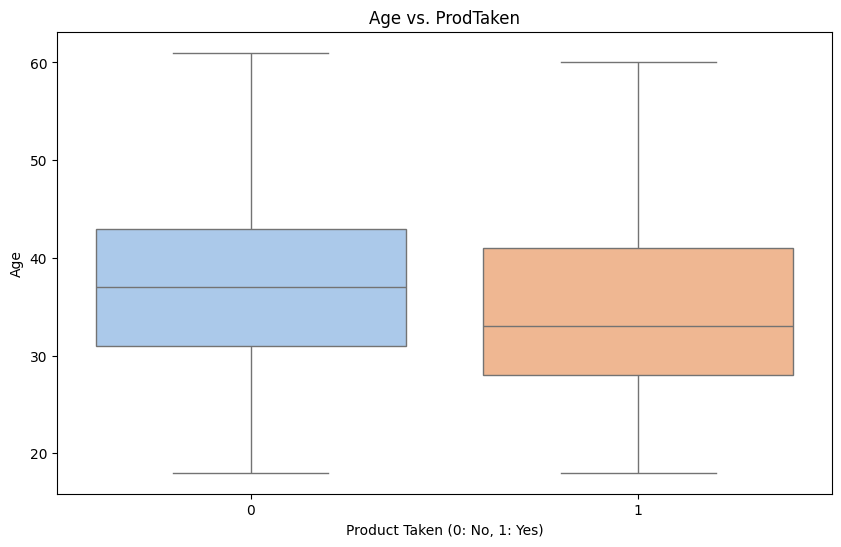

**💡 Observation:** A comparison of **Age** distribution between buyers and non-buyers reveals potential differentiating factors. Higher Age seems to correlate with ProdTaken.

### Multivariate DurationOfPitch vs. ProdTaken
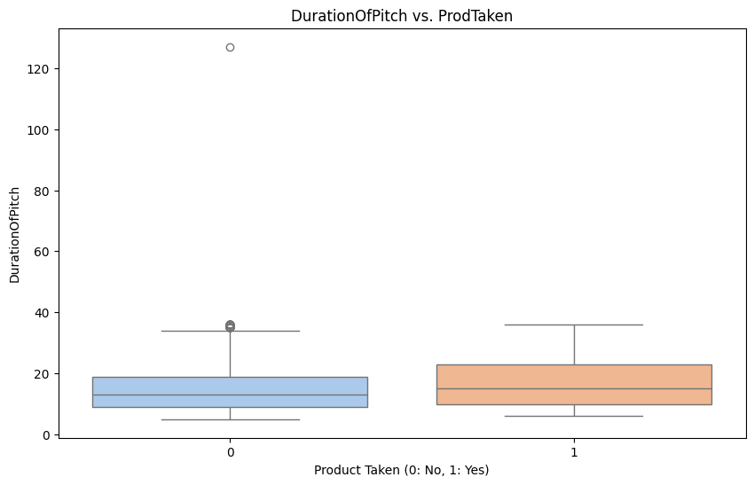

**💡 Observation:** A comparison of **DurationOfPitch** distribution between buyers and non-buyers reveals potential differentiating factors. Higher DurationOfPitch seems to correlate with ProdTaken.

### Multivariate NumberOfPersonVisiting vs. ProdTaken
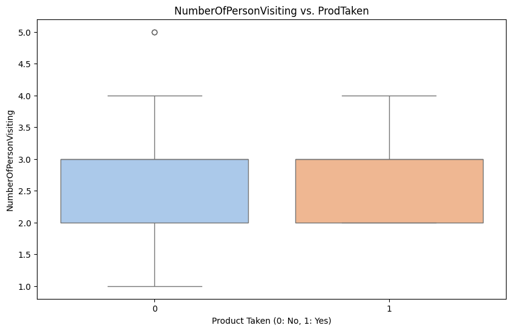

**💡 Observation:** A comparison of **NumberOfPersonVisiting** distribution between buyers and non-buyers reveals potential differentiating factors. Higher NumberOfPersonVisiting seems to correlate with ProdTaken.

### Multivariate PreferredPropertyStar vs. ProdTaken
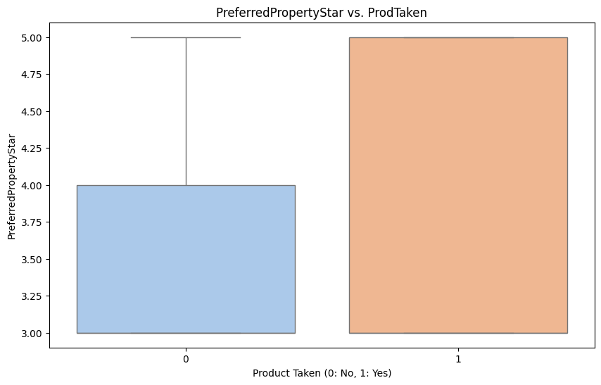

**💡 Observation:** A comparison of **PreferredPropertyStar** distribution between buyers and non-buyers reveals potential differentiating factors. Higher PreferredPropertyStar seems to correlate with ProdTaken.

### Multivariate NumberOfTrips vs. ProdTaken

**💡 Observation:** A comparison of **NumberOfTrips** distribution between buyers and non-buyers reveals potential differentiating factors. Higher NumberOfTrips seems to correlate with ProdTaken.

### Multivariate NumberOfChildrenVisiting vs. ProdTaken
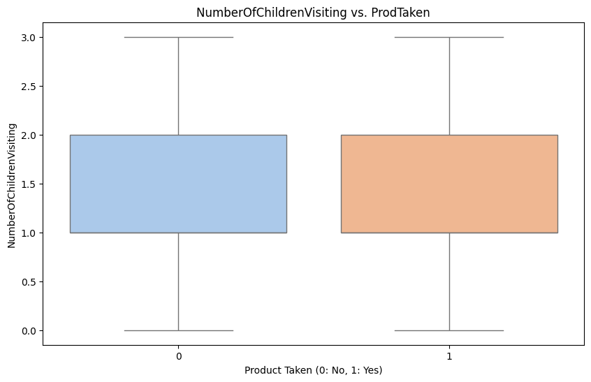

**💡 Observation:** A comparison of **NumberOfChildrenVisiting** distribution between buyers and non-buyers reveals potential differentiating factors. Higher NumberOfChildrenVisiting seems to correlate with ProdTaken.

### Multivariate MonthlyIncome vs. ProdTaken
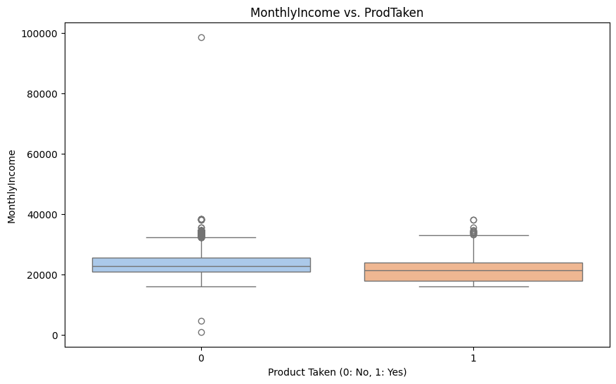

**💡 Observation:** A comparison of **MonthlyIncome** distribution between buyers and non-buyers reveals potential differentiating factors. Higher MonthlyIncome seems to correlate with ProdTaken.

### Multivariate PitchSatisfactionScore vs. ProdTaken
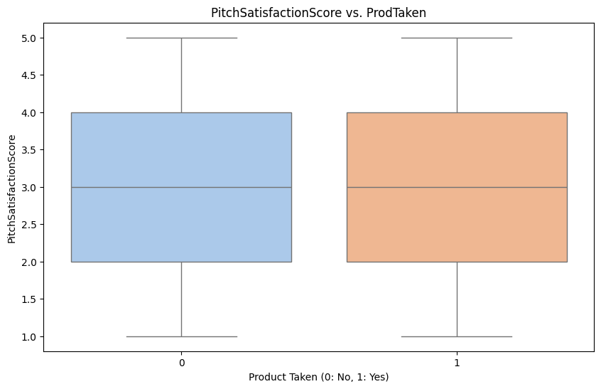

**💡 Observation:** A comparison of **PitchSatisfactionScore** distribution between buyers and non-buyers reveals potential differentiating factors. Higher PitchSatisfactionScore seems to correlate with ProdTaken.

### Multivariate TypeofContact vs. ProdTaken Proportions
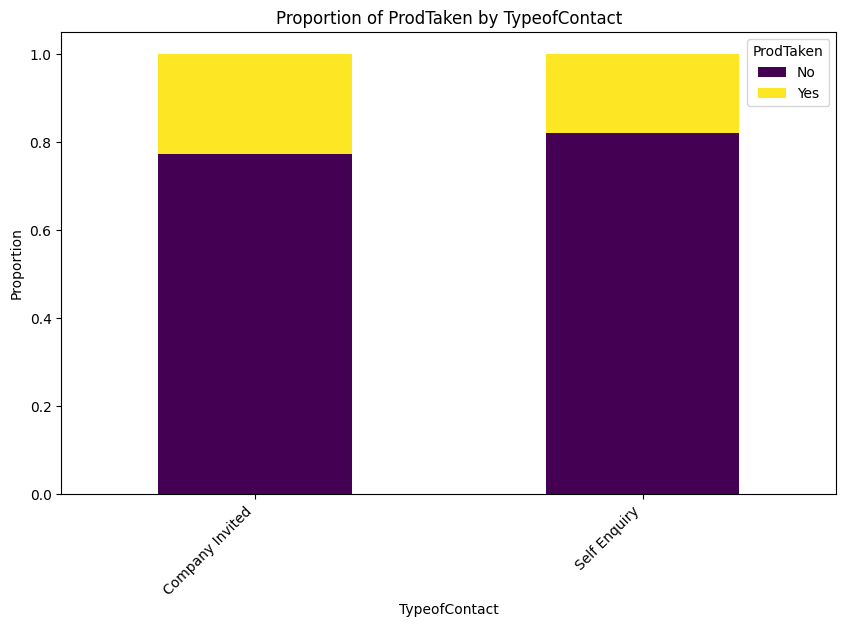

**💡 Observation:** This stacked bar chart shows the proportion of product taken within each category of **TypeofContact**, highlighting categories with higher purchase rates. Certain categories in TypeofContact show a significantly higher likelihood of purchase.

### Multivariate CityTier vs. ProdTaken Proportions
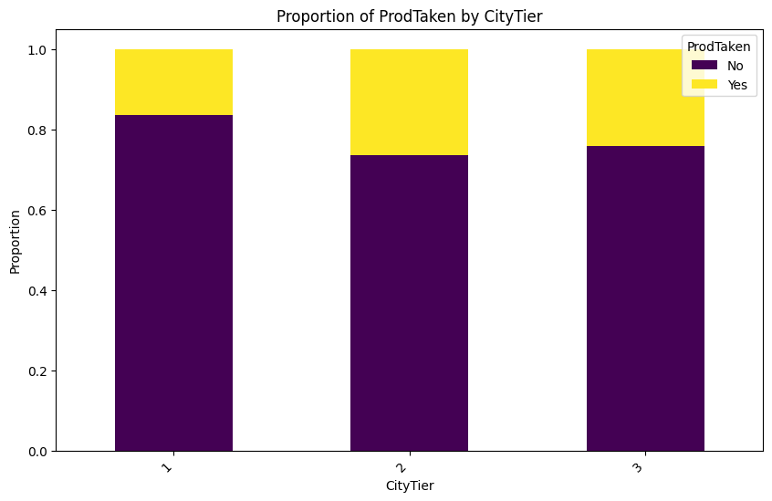

**💡 Observation:** This stacked bar chart shows the proportion of product taken within each category of **CityTier**, highlighting categories with higher purchase rates. Certain categories in CityTier show a significantly higher likelihood of purchase.

### Multivariate Occupation vs. ProdTaken Proportions
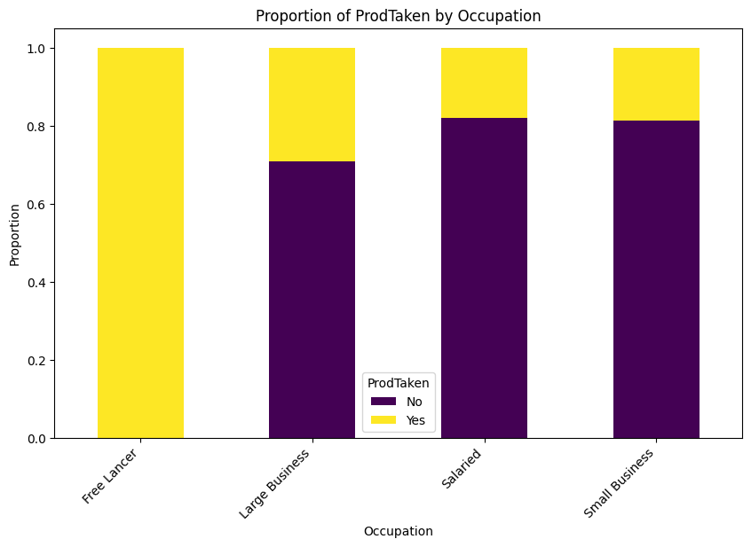

**💡 Observation:** This stacked bar chart shows the proportion of product taken within each category of **Occupation**, highlighting categories with higher purchase rates. Certain categories in Occupation show a significantly higher likelihood of purchase.

### Multivariate Gender vs. ProdTaken Proportions
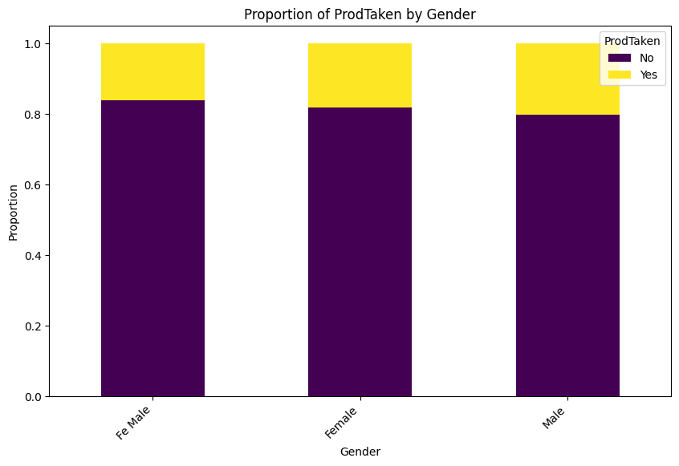

**💡 Observation:** This stacked bar chart shows the proportion of product taken within each category of **Gender**, highlighting categories with higher purchase rates. Certain categories in Gender show a significantly higher likelihood of purchase.

### Multivariate ProductPitched vs. ProdTaken Proportions
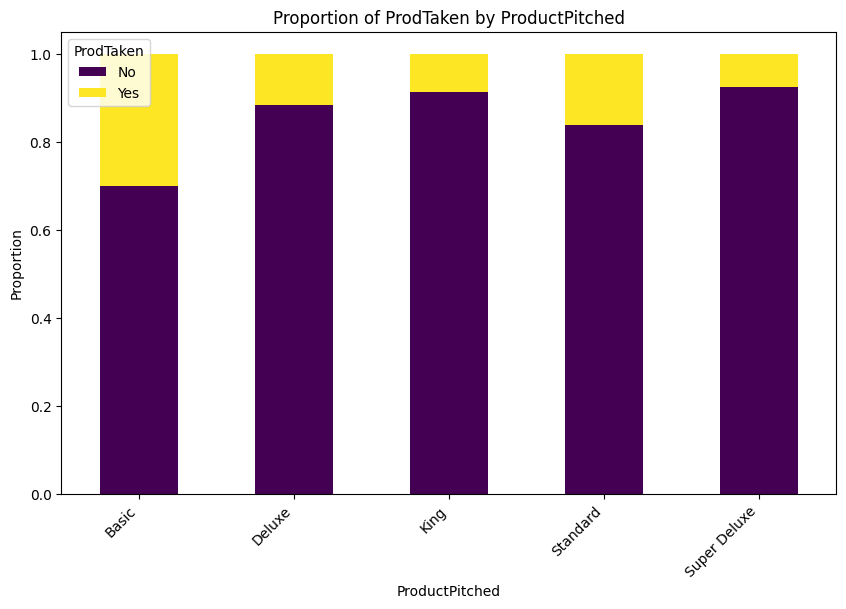

**💡 Observation:** This stacked bar chart shows the proportion of product taken within each category of **ProductPitched**, highlighting categories with higher purchase rates. Certain categories in ProductPitched show a significantly higher likelihood of purchase.

### Multivariate MaritalStatus vs. ProdTaken Proportions
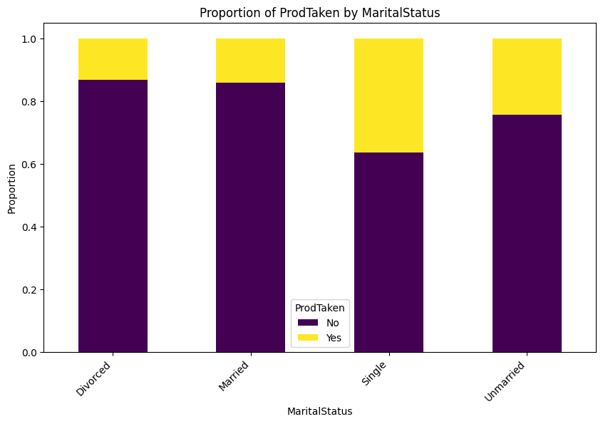

**💡 Observation:** This stacked bar chart shows the proportion of product taken within each category of **MaritalStatus**, highlighting categories with higher purchase rates. Certain categories in MaritalStatus show a significantly higher likelihood of purchase.

### Multivariate Passport vs. ProdTaken Proportions
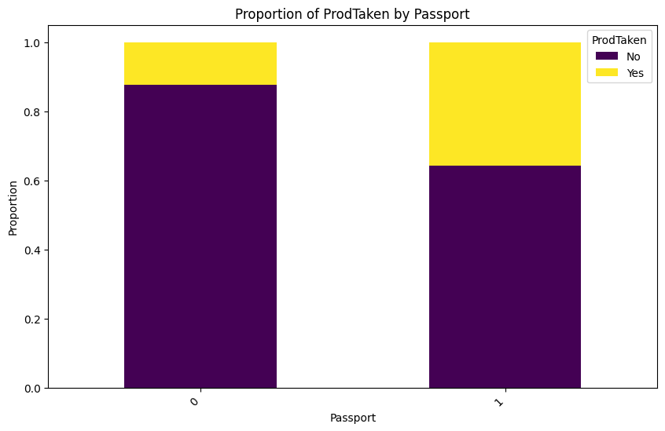

**💡 Observation:** This stacked bar chart shows the proportion of product taken within each category of **Passport**, highlighting categories with higher purchase rates. Certain categories in Passport show a significantly higher likelihood of purchase.

### Multivariate OwnCar vs. ProdTaken Proportions
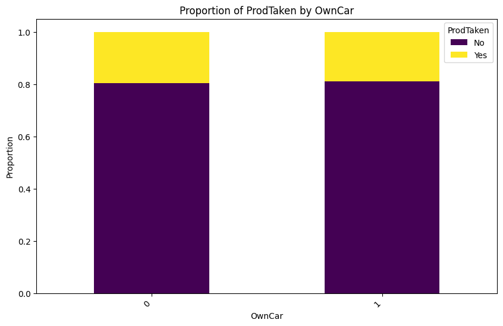

**💡 Observation:** This stacked bar chart shows the proportion of product taken within each category of **OwnCar**, highlighting categories with higher purchase rates. Certain categories in OwnCar show a significantly higher likelihood of purchase.

### Multivariate Designation vs. ProdTaken Proportions
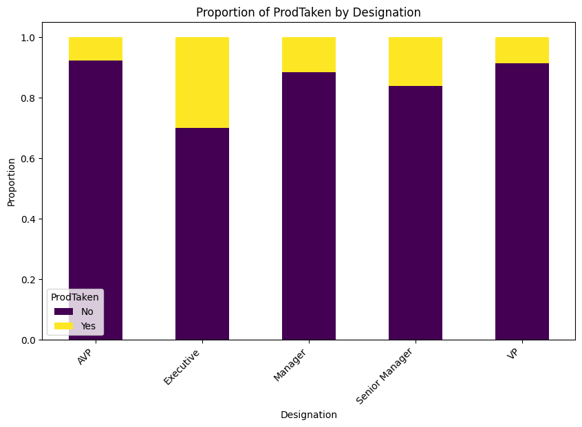

**💡 Observation:** This stacked bar chart shows the proportion of product taken within each category of **Designation**, highlighting categories with higher purchase rates. Certain categories in Designation show a significantly higher likelihood of purchase.

